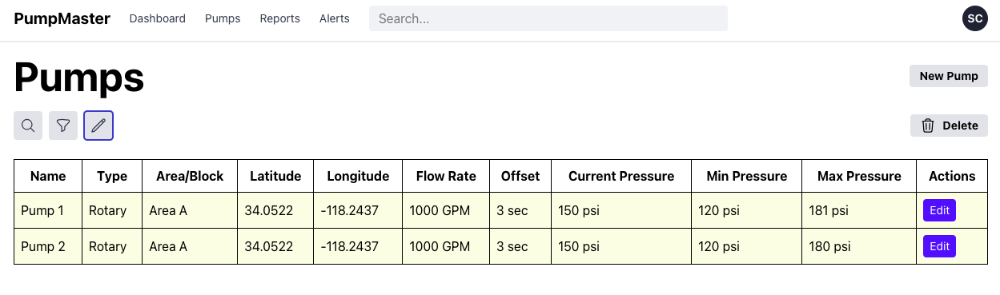

# pumpMaster built with react, vite and Tailwind CSS


## Assumptions
- All data is stored via localStorage as a mock database.


## How to run
```bash
git clone https://github.com/Red-Oolong-Tea/pumpMaster.git
```
```bash
cd pump
```
```bash
npm install
```
```bash
npm run dev
```


## Features
### Login with localStorage-based token simulation


### Pump List with searchable, filterable and manageable


### Pump list searchable


### Pump list filterable


### pump list managable


### Add new pump function


### Edit Pump 


### Delete Pump


### Navigation to individual pump detail pages


### Logout and remove token


